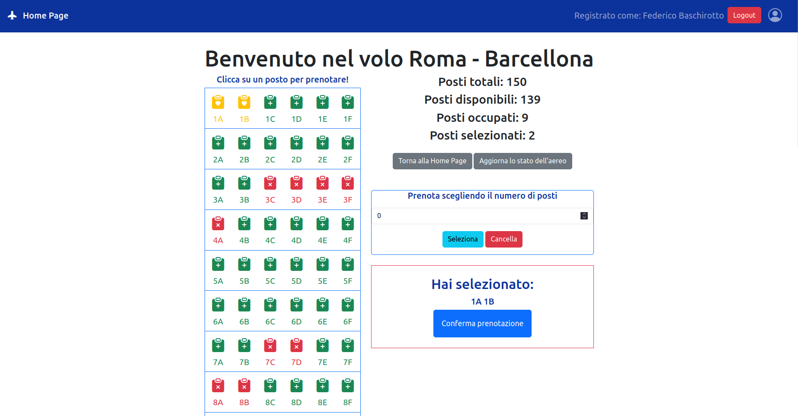

# Exam #2: "Posti aereo"
## Student: s310171 PEDONE MATTEO

## React Client Application Routes

- Route `/`: definisce l'Outlet in cui saranno renderizzate le Route figlie
- Route index: contiene la pagina principale in cui è possibile vedere l'elenco di aerei/voli disponibili, e se autenticati, anche le prenotazioni del    relativo user
- Route `/login`: pagina per fare il login
- Route `/airplane/:id_airplane`: mostra informazioni sull'aereo selezionato
- Route `*`: una qualsiasi pagina che non corrisponde a quelle sopra indicate e che indica che si è fatto accesso a una pagina inesistente

## API Server

### Voli APIs

- GET  `/api/airplanes`
  - Non autenticata: nessun parametro nella richiesta e ritorna un vettore di oggetti airplane

- GET `/api/airplane/:id_airplane/checkAirplane`
  - Non autenticata: parametro id_airplane che indica l'id dell'aereo e ritorna l'oggetto airplane con quell'id_airplane

- GET `/api/userBookings/`
  - Autenticata: nessun parametro e ritorna le prenotazioni dell'utente autenticato

- GET `api/airplane/:id_airplane/getAirplaneBookings`
  - Non autenticata: parametro id_airplane che indica l'id dell'aereo e ritorna le prenotazioni che sono state effettuate su quell'aereo

- DELETE `api/booking/:id_airplane/deleteBooking`
  - Autenticata: parametro id_airplane che indica l'id dell'aereo e non ritorna nulla

- POST `api/newBookings/:id_airplane/addBooking`
  - Autenticata: parametro id_airplane che indica l'id dell'aereo e nel body della richiesta è presente un vettore di posti da prenotare. Non ritorna nulla

### Autenticazione

- POST `/api/sessions`
  - vengono passate le credenziali dell'utente nel body della richiesta e ritorna l'oggetto user

- GET `api/session/current`
  - il codice utente è fornito dalla sessione passport, non ci sono parametri e ritorna l'oggetto user

- DELETE `api/session/current`
  - il codice utente è fornito dalla sessione passport, non ci sono parametri e non ritorna nulla 

## Database Tables

- Table `user` : (id, email, name, hash, salt)
- Table `airplane` : (id, departure, arrival, duration, type, rows, cols)
- Table `booking` : (id_airplane, id_user, seat)

## Main React Components

- `Navigation` (in `Navigation.jsx`): navbar che contiene il titolo e il buttone di login e logout

- `LoginForm` (in `AuthComponents.jsx`): form in cui poter inserire email e password per effettuare il login

- `HomePage` (in `Homepage.jsx`): componente in cui è presente lo scheletro della pagina principale e ne viene definita l'organizzazione
- `FlightCard` (in `Homepage.jsx`): componente in cui viene mostrato il singolo aereo con le sue informazioni principali e un bottone per visualizzare o prenotare i posti 
- `BookingCard` (in `HomePage.jsx`): componente che mostra la singola prenotazione (insieme di posti) dell'utente su un certo aereo. Viene visualizzato solo se un utente è loggato e se ha fatto almeno una prenotazione.
- `NotFoundLayout` (in `HomePage.jsx`): componente che viene chiamato quando si fa accesso a una pagina non esistente
- `DefaultLayout` (in `HomePage.jsx`): componente che definisce il contenitore in cui verranno visualizzate le informazioni delle Route figlie di '/'

- `Airplane` in (`Airplane.jsx`): componente che visualizza le informazioni dell'aereo selezionato nella HomePage con annesse informazioni sui posti. Viene visualizzata la distribuzione dei posti occupati e liberi, che possono essere selezionati in modo manuale cliccando sulle singole icone o usando un apposito form inserendo il numero di posti desiderati.

## Screenshot

## Users Credentials

- email: `user1@gmail.com`, password: `password` 
- email: `user2@gmail.com`, password: `password` 
- email: `user3@gmail.com`, password: `password` 
- email: `user4@gmail.com`, password: `password` 

## Additional notes

Ho assunto nel database, più in particolare nella tabella airplane, che ci sia un singolo aereo per ogni volo.
I primi due utenti hanno effettuato prenotazioni, gli ultimi due no